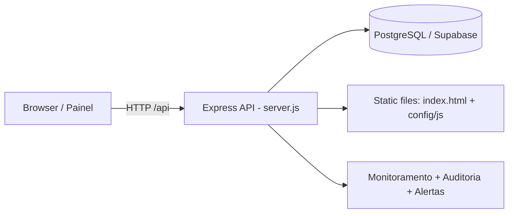
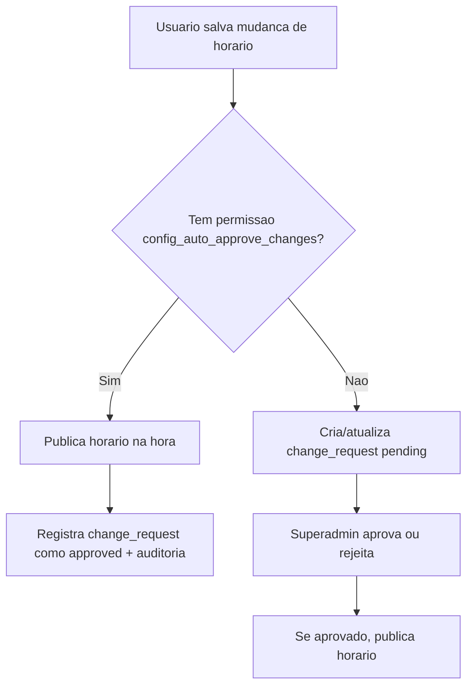

# SinalTech Multi-School

Sistema web para gerenciamento de sinais escolares com suporte multi-escola, perfis com permissoes granulares, auditoria, monitoramento e fluxo de aprovacao/autoaprovacao de mudancas de horarios.

## Sumario

- [Visao geral](#visao-geral)
- [Arquitetura](#arquitetura)
- [Stack e estrutura](#stack-e-estrutura)
- [Configuracao de ambiente](#configuracao-de-ambiente)
- [Como rodar localmente](#como-rodar-localmente)
- [Perfis e permissoes](#perfis-e-permissoes)
- [Fluxo de horarios](#fluxo-de-horarios)
- [Endpoints da API](#endpoints-da-api)
- [Deploy na Vercel](#deploy-na-vercel)
- [Troubleshooting](#troubleshooting)
- [Documentacao completa em PDF](#documentacao-completa-em-pdf)

## Visao geral

Funcionalidades principais:

- Multi-escola com escopo por usuario.
- Painel de configuracao de horarios por periodo.
- Acionamento manual de audio (com permissao dedicada).
- Gestao de usuarios e escolas.
- Permissoes por menu e por funcao (heranca + override por usuario).
- Simulacao de login (somente superadmin).
- Aprovacao manual de mudancas de horarios.
- Autoaprovacao de mudancas por permissao.
- Templates de horarios.
- Backup/export/import/restauracao.
- Auditoria completa de acoes.
- Alertas operacionais e healthcheck de banco.
- Historico operacional diario com grafico.

## Arquitetura



## Stack e estrutura

- Backend: `Node.js`, `Express`, `pg`, `jsonwebtoken`, `bcryptjs`.
- Frontend: HTML + JS vanilla (`config/js/config-section.js`, `config/js/index.js`).
- Banco: PostgreSQL (Supabase suportado).
- Deploy serverless: Vercel (`api/[...route].js`).

Arquivos principais:

- `server.js`: API principal, auth, permissoes, regras de negocio.
- `db/schema.sql`: schema base do banco.
- `index.html`: UI principal.
- `config/js/config-section.js`: painel admin/configuracoes.
- `config/js/index.js`: tela operacional/dashboard.
- `api/[...route].js`: adapter para runtime serverless da Vercel.

## Configuracao de ambiente

Copie:

```bash
cp .env.example .env
```

Variaveis suportadas:

- `PORT`: porta local (padrao `3000`).
- `DATABASE_URL`: string completa de conexao Postgres.
- `DB_HOST`, `DB_PORT`, `DB_NAME`, `DB_USER`, `DB_PASSWORD`: alternativa ao `DATABASE_URL`.
- `DB_DNS_SERVERS`: fallback DNS (ex.: `8.8.8.8,1.1.1.1`).
- `JWT_SECRET`: segredo JWT (obrigatorio em producao).
- `JWT_EXPIRES_IN`: exp de token principal (padrao `12h`).
- `SIMULATION_TOKEN_TTL`: exp de token de simulacao (padrao `30m`).
- `PASSWORD_MIN_LENGTH`: tamanho minimo da senha forte (padrao `10`).
- `LOGIN_RATE_LIMIT_WINDOW_MS`: janela do rate limit de login (padrao `900000`).
- `LOGIN_RATE_LIMIT_MAX_ATTEMPTS`: tentativas maximas por IP+email na janela (padrao `8`).
- `LOGIN_RATE_LIMIT_BLOCK_MS`: bloqueio apos exceder tentativas (padrao `1200000`).
- `DEFAULT_ADMIN_NAME`, `DEFAULT_ADMIN_EMAIL`, `DEFAULT_ADMIN_PASSWORD`: seed inicial do superadmin (somente quando nao existem usuarios).
- `MONITOR_INTERVAL_MS`: intervalo do sweep de monitoramento.
- `DAILY_BACKUP_INTERVAL_MS`: intervalo do backup automatico diario.
- `AUDIT_LOG_RETENTION_DAYS`: retencao automatica dos logs de auditoria em dias (padrao `180`).
- `HTTP_METRICS_MAX_EVENTS`: maximo de eventos HTTP em memoria (padrao `20000`).
- `HTTP_METRICS_MAX_AGE_MS`: idade maxima dos eventos HTTP em memoria (padrao `86400000`).

Observacao:

- Em `NODE_ENV=production`, usar `JWT_SECRET` forte.

## Como rodar localmente

1. Instale dependencias:

```bash
npm install
```

2. Suba a API:

```bash
npm start
```

3. Acesse:

- `http://localhost:3000`

4. Healthcheck:

- `GET http://localhost:3000/api/health`

5. Testes automatizados:

```bash
npm test
```

## Perfis e permissoes

Perfis base:

- `superadmin`: acesso global.
- `admin_escola`: escopo da propria escola.
- `somente_leitura`: leitura da propria escola.

### Menus controlados

- `dashboard`
- `config`
- `schools`
- `users`
- `audit`

### Funcoes controladas (destaques)

- Dashboard:
  - `dashboard_manual_section`
  - `dashboard_manual_play`
  - `dashboard_last_signal`
  - `dashboard_next_signal`
  - `dashboard_schedule_interface`
  - `dashboard_database_status`
  - `dashboard_open_alerts`
  - `dashboard_schools_without_schedule`
  - `dashboard_monitor_alerts`
  - `dashboard_operational_history`
  - `dashboard_http_metrics_view`
  - `dashboard_http_metrics_filters`
- Config:
  - `config_schedule_write`
  - `config_approve_changes`
  - `config_auto_approve_changes`
  - `config_templates`
  - `config_backup_export`
  - `config_backup_import`
  - `config_backup_restore`
- Usuarios:
  - `users_create`
  - `users_edit`
  - `users_disable`
  - `users_reset_password`
- Auditoria:
  - `audit_view`

### Aprovacao manual x autoaprovacao

- `config_approve_changes`:
  - permite aprovar/rejeitar solicitacoes pendentes (normalmente superadmin).
- `config_auto_approve_changes`:
  - publica mudancas direto, sem ficar pendente.
  - quando desativado, a mudanca vira solicitacao (`pendingApproval=true`).

## Fluxo de horarios



## Endpoints da API

### Sistema

- `GET /api/health`

### Auth e usuarios

- `POST /api/auth/login`
- `GET /api/auth/me`
- `POST /api/auth/simulate/user/:id`
- `POST /api/auth/change-password`
- `GET /api/auth/users`
- `POST /api/auth/users`
- `PATCH /api/auth/users/:id`
- `POST /api/auth/users/:id/reset-password`
- `DELETE /api/auth/users/:id`

### Escolas e horarios

- `GET /api/schools`
- `POST /api/schools`
- `PATCH /api/schools/:id`
- `DELETE /api/schools/:id`
- `GET /api/schools/:id/schedule`
- `PUT /api/schools/:id/schedule`
- `GET /api/schools/:id/change-requests`
- `POST /api/change-requests/:id/approve`
- `POST /api/change-requests/:id/reject`

### Templates

- `GET /api/templates`
- `POST /api/templates`
- `POST /api/templates/:id/clone-to-school`

### Backups

- `GET /api/schools/:id/backup`
- `GET /api/schools/:id/backups`
- `GET /api/schools/:id/backups/:backupId`
- `POST /api/schools/:id/restore`
- `POST /api/schools/:id/restore-backup`

### Auditoria, alertas e monitoramento

- `GET /api/audit-logs`
- `GET /api/alerts`
- `PATCH /api/alerts/:id/resolve`
- `POST /api/monitor/playback-error`
- `GET /api/monitor/status`
- `GET /api/monitor/history`
- `GET /api/monitor/http-metrics` (requer permissao `dashboard_http_metrics_view`)

Eventos de auditoria de leitura:
- Visualizacao de lista de backups por escola.
- Visualizacao de snapshot individual de backup.
- Consulta de metricas HTTP de observabilidade.

## Deploy na Vercel

Ja configurado:

- `api/[...route].js` encaminha requests para `server.js`.
- `vercel.json` define runtime Node para a funcao.

Checklist de deploy:

1. Definir variaveis de ambiente no projeto da Vercel (`DATABASE_URL`, `JWT_SECRET`, etc.).
2. Deploy da branch.
3. Testar:
   - `/api/health`
   - login
   - leitura de escolas/horarios
   - uma escrita (com perfil permitido)

## Troubleshooting

- `EADDRINUSE` na porta local:
  - finalize o processo anterior ou altere `PORT`.
- `/api/health` com `database_unavailable`:
  - revisar credenciais, host/porta e SSL.
- `ENOTFOUND`/DNS:
  - configurar `DB_DNS_SERVERS`.
- `401 invalid_token`:
  - limpar sessao no browser e relogar.
- `403 simulation_read_only`:
  - em simulacao, backend bloqueia escrita por seguranca.
- `permission_denied`:
  - revisar permissoes efetivas do usuario (perfil + override).

## Documentacao completa em PDF

Manual completo com instrucoes visuais:

- [docs/Manual-SinalTech.pdf](./docs/Manual-SinalTech.pdf)
- Fonte editavel do manual:
  - [docs/Manual-SinalTech.html](./docs/Manual-SinalTech.html)
